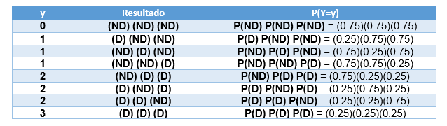

<style>
#TOC {
  color: black;
  font-familiy: Calibri;
  font-size: 14px;
  border-color: #708090; 
}
body {
   color: black;
   font-familiy: Calibri;
}

pre {
  color: black;
  background-color: #F8F8FF;
}
# header {
  color: #800000;
  font-familiy: Calibri;
  background-color: #F5F5F5;
  opacity: 0.8;
  font-size: 16px;
}
</style>


```{r setup, include=TRUE, warning=FALSE,message=FALSE}
knitr::opts_chunk$set(echo = TRUE)

# Librería stats está instalada por defecto en la base de R
library(stats)

# Librería pander permite crear tablas con leyendas en Rmarkdown
library(pander)

# Librería MASS contiene funciones de apoyo para trabajar con el libro de Venables and Ripley llamado Modern Applied Statistics with S (2002) 
library(MASS)

# Librería Rlab permite cargar las funciones para la distribución Bernoulli.
library(Rlab)

```
#### **Introducción**


#### **Clasificación de variables**

**Variables discretas:** Una variable **Y** es **_discreta_** si puede tomar valores puntales (enteros positivos incluyendo el cero), puede tener un número finito o infinito de valores. Todas las probabilidades asociadas a cada valor de la variable aleatoria discreta deberán sumar 1. La función de distribución de probabilidad acumulada es, la probabilidad de que la variable aleatoria sea menor o igual a un valor particular. 

**Tipos de distribución de variables discretas**

Hay diferentes tipos de distribuciones acordes a variables cuantitativas discretas, en este caso solo veremos dos, estás son: la distribucción **_Bernoulli_** **(Be)** y la **_distribución Binomial_** **(B)**.

La **distribución bernoulli** aplica a un caso especial de variable discreta cuando solo hay dos niveles. Estos niveles usalmente representan la ocurrencia de un evento (exito) o su ausencia (fracaso) y se representan con los números 1 y 0 respectivamente. 

Ejemplo variables con distribución bernoulli: vivo frente a un desafío a un patógeno (0), muerto (1); positivo a un patógeno (1) o negativo (0).

Ejemplo de variable con distribución binomial: Abundancia de parásitos en un pez.

#### **Distribución de una variable discreta**

**_Distribución empírica (observación)_**: Los datos de una muestra, obtenidos de forma aleatoria de una población, pueden ser usados para observar su distribución. 

**_Distribución de probabilidad (predicción)_**: Las variables aleatorias tienen diferente distribución de probabilidad asociada, es decir, ésta dependerá de la naturaleza de la variable aleatoria en estudio. Considerando esto, es posible predecir su comportamiento y realizar inferencias estadísticas.

#### **Objetivos de aprendizaje**

Los objetivos de aprendizaje de esta guía son:

**1**. Observar y predecir el comportamiento de variables aleatorias discretas con distribución Bernoulli.

**2**. Observar y predecir el comportamiento de variables aleatorias discretas con distribución de Binomial.

**3**. Elaborar un reporte html con **[Rmarkdown](https://rmarkdown.rstudio.com/)**.


#### **Comandos**

A continuación, se presentan algunos comandos que podrían ser usados para resolver los ejercicios de esta guía. Otros, los usará más adelante en el curso y los deberá investigar por su propia cuenta. 

**_¿Cómo puedo observar el comportamiento de una variable discreta?_**

**1.-** Tabla de distribución de frecuencia **table()**.

**2.-** Gráfico de barras **barplot()**.

**3.-** Histograma **hist()**.

**_¿Cómo puedo predecir el comportamiento de una variable con distribución Bernoulli?_**

**4.-** Mediante la **_función de distribución de probabilidad acumulada_** **pbern()**.

**5.-** Mediante **_la función de densidad de probabilidad Bernoulli_** **dbern()**.

**6.-** Mediante la función para encontrar los **_cuantiles_** **qbern()**.

**_¿Cómo puedo predecir el comportamiento de una variable con distribución Binomial?_**

**7.-** Mediante la **_función de distribución de probabilidad acumulada_** **pbinom()**.

**8.-** Mediante la **_función de densidad de probabilidad Binomial_** **dbinom()**.

**9.-** Mediante la función para encontrar los **_cuantiles_** **qbinom()**.

**_¿Cómo puedo simular números aleatorios con distribución Binomial y Bernoulli?_**

**10.-**  Simular variable aleatoria Bernoulli
**rbern()**

**11.-** Simular variable aleatoria Binomial
**rbinom()**

### **Ejercicios**

### **Ejercicio 1.** Elaborar archivo Rmarkdown
Elabore un archivo o file con extensión .Rmd y configurelo para exportar el resultado como un documento dinámico pdf. Utilice el siguiente ejemplo para completar la información de metadatos: Título: Reporte EDA, nombre del autor: Su nombre.

Luego guarde inmediatamente su script como script_4_nombre_apellido.Rmd. Al finalizar la actividad deberá exportar y almacenar este script en su carpeta drive de tareas.

Ejercicio 2. Configuración del reporte
En el primer bloque de códigos o chunk configure los comandos de la siguiente manera:

{r setup, include=TRUE, warning=FALSE,message=FALSE}

knitr::opts_chunk$set(echo = TRUE)

Cargue las librerías stats, Rlab, MASS y pander usando la función library().

Ejercicio 3. Borrar información de la plantilla
Borre los bloques de códigos R que se generan automáticamente con cada archivo .Rmd y reemplacelos por nuevos bloques de códigos con el botón verde +C que se encuentra en la parte superior del panel de códigos.

Ejecute cada uno de los siguientes ejercicios en uno o más bloques de códigos diferentes. Sea ordenado y documente su reporte adecuadamente.
Para la exportación de salmón se implementa un sistema de inspección visual del producto, clasificando a los peces como defectuosos **(D)** y no defectuosos **(ND)**.

**a.** ¿Que tipo de variable y distribución mejor representará el número de salmones defectuosos?

```{r}
# Variable Discreta
# Distribución Binomial
```
**b.** Si en un proceso de inspección se detectó un total de 8 salmones defectuosos y 24 no defectuosos. ¿Cuál es la probabilidad de que los salmones sean defectuosos?  

```{r}
p <- 8 / 32
```
**c.** ¿Cuál es la probabilidad de que no sean defectuosos?
```{r}
q <- 1-p
```

**d** El comprador del salmón desea checar que la información de origen de la proporción de salmón defectuosa es correcta. Para ello deside tomar una muestra aleatoria de solo 3 salmones.

Responda las siguientes preguntas usando la información de la siguiente tabla relacionada al ejercicio 1:

```{r, echo=FALSE, out.width = '80%' }

```

**e.** ¿Cuál es la probabilidad de que el comprador no detecte salmones defectuosos?

```{r}
# P(Y=0)  
P_ND <- q*q*q
```

**f.** ¿Cuál es la probabilidad de que detecte que todos son salmones defectuoso?

```{r}
# P(Y=3)  
P_PD <- p*p*p
```

### **Ejercicio 2.**

La abundancia de parásitos como el piojo de mar *Caligus rogercresseyi* en los salmones de cultivo en Chile puede ser considerada como una variable distreta con distribución binomial negativa. Esto significa que uno suele observar muchos peces con pocos parásitos (ej= 0 o 1) y pocos peces con muchos parásitos. Un estudio demostró que el promedio de la abundancia de parásitos fue de 25 con un rango de 0 a 100. 

A partir de estos datos realice una simulación del número de parásitos como  se indica a continuación.

**a. ** Cree un objeto llamado **caligus** para representar el número de parásitos en los peces. Simule una muestra aletoria con distribución binomial negativa con la función **rnegbin()**. Considere 1000 peces con una media de 25 parásitos. Para simular la varianza debe asignar valores arbitrarios al argumento **theta** entre 1 y 5 hasta obtener un promedio y rango aproximado al estudio antes descrito. Para evitar que la simulación genere un resultado diferente cada vez, incluya en la primera línea de codigo el siguiente comando **set.seed(123)**.

```{r}
set.seed(123)
# n = 1000 animales
# mu = 25 (parásitos por pez)
# theta = 1 (cambie este valor hasta encontrar uno que se ajuste a los datos observados en el ejercicio)
caligus <- rnegbin (1000, 25, 3)
```

**b. **  Use las funciones **head()** y **range()** para observar sus datos. Compare las funciones **quantile()** y **summary()**.

```{r}
head(caligus)
range(caligus)
quantile(caligus)
summary(caligus)
```

**c. ** ¿Que parámetro representa mejor los datos, la mediana o la media?
 
```{r}
# La mediana representa mejor los datos puesto que la media es muy influenciable por los valores extremos.
```
 
**d. ** A partir de la simulación anterior elabore un histograma y una gráfica de cajas y bigotes. Use la función **par(mfrow=c(1,2))** para generar las gráficas en una sola fila y con 2 columnas. 

```{r}
par(mfrow=c(1,2))
hist(caligus, col="lightblue")
boxplot(caligus, col="lightblue", main="Boxplot of caligus", horizontal = TRUE, xlab="caligus")
```

**e. ** A partir de la simulación de parásitos y usando la función **plot()** elabore una gráfica con la distribución acumulada empírica. Debe incluir la función **ecdf()**.

```{r}
# Distribución acumulada empírica.
plot(ecdf(caligus), main="Distribución acumulada empírica", xlab="caliguss (n)")
```

**f. ** A partir de la simulación de parásitos y usando la función **plot()** elabore elabore una gráfica con la densidad empírica. Debe incluir la función **density()**.

```{r}
# Densidad empírica.
plot(density(caligus), main="Densidad empírica", xlab="caliguss (n)")
```

**g. ** En una sola gráfica combine un histograma hist() y una función de densidad de los datos simulados use **lines(density())**.

```{r}
hist(caligus, probability = TRUE, col="lightblue", main = "Histogram and Kernel Density")
lines(density(caligus, from = 0, to = 13))
```

### **Ejercicio 3.**

*Alexandrium catenella* es una microalga tóxica que produce el veneno paralizante de los mariscos (VPM). En Chile las intoxicaciones por VPM entre 1972-2002 generaron 456 enfermos y 30 fallecidos (total = 486). A partir de estos antecedentes responda.

**a.** ¿Cuál es la letalidad por VPM en Chile?

```{r}
30 / 486
```

**b.** ¿Que tipo de variable y distribución mejor representa a la intoxicación por VPM?

```{r}
# "Variable Discreta"
# "Distribución Bernoulli"
```

**c.** Se ha reportado un intoxicación masiva de veneno paralizante de los mariscos en Calbuco que dió como resultado 80 personas intoxicadas. ¿Cuántas personas se recuperarán (0) y cuantas morirán (1) por esta intoxicación?. 

Para responder primero cree un objeto denominado **rvpm** y simule el resultado de la intoxicación usando **rbinom()**. Use **print()** para observar sus datos simulados.

```{r}
set.seed(123)
n <- 80
p <- 0.0617
q <- 1-p
rvpm<-rbinom(n, size=1, prob=0.0617)
print(rvpm)
```

**d.** Represente en una tabla la frecuencia esperada de recuperados y fallecidos
```{r}
table(rvpm)

#Tabla con formato para reporte

knitr::kable(
  table(rvpm),
  row.names = TRUE
  , caption = "Recuperados (0) versus fallecidos (1)")
```

**d.** represente en un histograma la frecuencia de recuperados y fallecidos
```{r, out.width = '80%'}
hist(rvpm, col="red", main = "Histograma Intoxicación por VPM")
```

**e.** Investigue como se calcula el promedio y la varianza de una variable con distribución binomial. Calcule ambos parámetros para la población de estudio.

Promedio de fallecidos
```{r}
n*p
```

Varianza de fallecidos
```{r}
n*p*q
```

**f.** Gráfique función de densidad de las intoxicaciones por VPM usando una la función plot. En el eje "x" grafique los datos simulados con rbinom() y en el eje "y" la función de densidad dbinom().

```{r, out.width = '80%'}
dvpm<-dbinom(rvpm, size=1, prob=0.0617)
plot(x=rvpm, y=dvpm, main="Densidad de rvpm", col="blue4")

```

**g.** Gráfique la  distribución de probabilidad acumulada de las intoxicaciones por VPM usando la función plot(). En el eje "x" grafique los datos simulados con rbinom() y en el eje "y" la probabilidad acumulada con pbinom().

```{r, out.width = '80%'}
pvpm<-pbinom(rvpm, size=1, prob=0.0617)
plot(x=rvpm, y=pvpm, main="Prob. acumul. rvpm", col="red", ylim=c(0,1))
```
