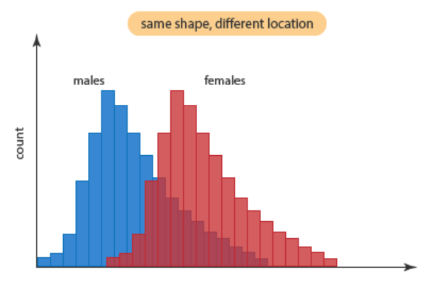

```{r setup, include=FALSE}
knitr::opts_chunk$set(echo = FALSE)
library(car)
library(lmtest)
```

## PLAN DE LA CLASE
**1.- Introducción**
    
- ¿Qué son las pruebas no paramétricas?
- Test de Correlación
- Prueba de asociación Chi cuadrado
- Pruebas de contraste no paramétrico
- Elaboración e interpretación pruebas no paramétricas con R

**2.- Práctica con R y Rstudio cloud**

- Realizar pruebas no paramétricas.

- Realizar gráficas avanzadas con ggplot2. 

- Elaborar un reporte dinámico en formato pdf.  

## MÉTODOS NO PARAMÉTRICOS

Conjunto diverso de pruebas estadísticas.

El concepto de “no paramétrico” a veces es confuso, pues los métodos no paramétricos si estiman y someten a prueban hipótesis usando parámetros, pero no los de distribución normal.

Se aplican usualmente para variables cuantitativas que no cumplen con el supuesto de normalidad y para variables cualitativas.

## SUPUESTOS: MÉTODOS NO PARAMÉTRICOS

El principal supuesto de los métodos no paramétricos es que las variables aleatorias son independientes y con identica distribución.

Usualmente no tienen supuestos acerca de la distribución de la variable, alternativamente se conocen como métodos de distribución libre.

El concepto matemático de permutación está subyacente a muchos métodos no paramétricos y se utiliza para someter a prueba una hipótesis.


## PRUEBA DE CORRELACIÓN NO PARAMÉTRICA

**¿Cuándo aplicar prueba de correlación no paramétrica?**    Cuando no se cumple uno o varios supuestos de la correlación paramétrica:     
- Las variables X e Y no son continuas.  
- No existe relación lineal.  
- La distribución conjunta de (X, Y) no es una distribución Bivariable normal.  

## EJEMPLO FUNCIÓN MONÓTONA

**¿Cuál es el supuesto que no se cumple?**  
No existe una relación lineal

```{r, out.width = '80%' }
set.seed(123)
x <- 1:20
y <- (1/4) * x^2 # Funcion monotona creciente

plot(x, y, type = 'b', main = 'Relación no lineal', frame.plot = FALSE, col = "dark red", lwd=2, font=2, cex.axis = 1.5)
```


## EJEMPLO VARIABLES DISCRETAS U ORDINALES

**¿Cuál es el supuesto que no se cumple?**  
Parásitos es variable discreta.

```{r, out.width = '80%' }
set.seed(0)
x <- trunc(runif(200)*10)
y <- x * 3 + trunc(runif(200)*10)
plot(y,x,pch=16, xlab = "Tamaño del pez", ylab = "parásitos", col = "red")
```

## EJEMPLO VARIABLES DISCRETAS U ORDINALES 2

**¿Cuál es el supuesto que no se cumple?**    
Parásitos no tiene distribución normal

```{r, echo=FALSE, out.width = '80%' }
qqPlot(y)
```


## COEFICIENTE DE CORRELACIÓN DE SPEARMAN

**¿Cómo se calcula?**    
Coeficiente de correlación de Spearman ($\rho$ = rho)

$$ \rho = 1- \frac {6\sum d^2}{n(n^2-1)}$$

|  **Fish size (X)** | **Parásitos (Y)**| **Ranking X ** | **Ranking Y** | $$d$$  | $$d^2$$ |
|:-------------|:------------------|:------------------|:------------------|:------------------|:------------------|
| 942 | 13 | 4 | 2 | 2 | 4 |
| 101 | 14 | 1 | 3 | -2 | 4 |
| 313 | 18 | 2 | 4 | -2 | 4 |
| 800 | 10 | 3 | 1 | 2 | 4 |
$$\sum d^2$$ = 16 ; **$\rho$ = -0,6**

## ¿CUÁNTAS CORRELACIONES SON POSIBLES?

Permutación: combinación ordenada de elementos.

P4 = 4! = 4 x 3 x 2 x 1 = 24 permutaciones posibles

Ejemplo 

| **Ranking X ** | **Ranking Y** |   | **Ranking X **| **Ranking Y**  |
|:-------------|:------------------|:------------------|:------------------|:------------------|
| 4 | 1 |  | 4 | 4 | 
| 1 | 4 |  | 1 | 1 | 
| 2 | 3 |  | 2 | 2 | 
| 3 | 2 |  | 3 | 3 | 
| $\rho$ = -1 |   |  |  |$\rho$ = 1 |

## DISTRIBUCIÓN MUESTRAL DE CORRELACIÓN

```{r}
cor_ps <- c(-1.0, -0.8, -0.8, -0.8, -0.6, -0.4, -0.4, -0.4, -0.2, -0.2, 0.0, 0.0,  0.2, 0.2, 0.4, 0.4, 0.4, 0.6, 0.6, 0.6, 0.8, 0.8, 0.8, 1.0)
cor_ps
```

## PRUEBA DE HIPÓTESIS DE CORRELACIÓN

|  **Hipótesis** | **Verdadera cuando**| 
|:-------------|:------------------|
| **H~0~**: X e Y mutuamente independientes | $\rho$ = 0|
| **H~1~**: X e Y no son mutuamente independientes | $\rho$ $\ne$ 0|

p = 10 / 24
p = 0.4167

No se rechaza **H~0~** porque p = 0,416 es mayor a 0,05


## PRUEBA DE CORRELACIÓN CON R

```{r, echo=TRUE}
# Crea objetos X e Y 
X <- c(942,101,313,800)
Y <- c(13,14,18,10)

# Realiza test de correlación
cor.test(X,Y, method = "spearman", alternative = "two.sided")

```

## PRUEBA DE MANN-WHITNEY

**¿Cuándo usarla?** 
Para comparar dos muestras con idéntica distribución, con diferentes medianas y sin normalidad.

Usualmente para variables discretas.

```{r, echo=FALSE, out.width = '80%' }

```


## PRUEBA DE MANN-WHITNEY

**¿Cómo se calcula el estadístico W?** 
Como la diferencia de los ranking entre tratamiento y control

|  **Tratamiento (T)** | **Control (C)**| **Ranking T ** | **Ranking C** |
|:-------------|:------------------|:------------------|:------------------|
| 9 | 0 | 4 | 1 | 
| 12 | 4 | 5 | 2 | 
| 13 | 6 | 6 | 3 | 
|  |  |  $$\sum$$ = 15 | $$\sum$$ = 6 |

*W* = 15 - 6 = 9


## PRÁCTICA ANÁLISIS DE DATOS
- Guía de trabajo práctico disponible en drive y Rstudio.cloud.  
**Clase_10**

- El trabajo práctico se realiza en Rstudio.cloud.  
**Clase 10 - Estadística no paramétrica**

## RESUMEN DE LA CLASE

- **Teoría**
- Supuestos de los análisis paramétricos.   
- Consecuencias de la violación de los supuestos.
- Interretación de métodos gráficos, análisis de residuos y pruebas de hipótesis para evaluar supuestos.

- **Evaluación de supuestos**
    * Independencia.  
    * Homocedasticidad.
    * Normalidad.