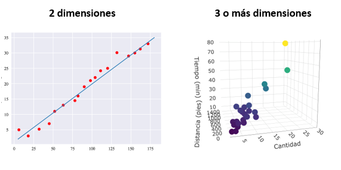
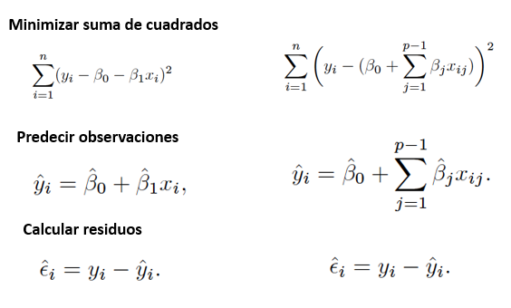

```{r setup, include=FALSE}
knitr::opts_chunk$set(echo = FALSE)
library(car)
library(lmtest)
library(psych)
```

## PLAN DE LA CLASE
**1.- Introducción**
    
-Modelo de regresión lineal múltiple.

-El problema de la multicolinealidad.

-¿Cómo seleccionar variables?.

-¿Cómo comparar modelos?.

-Interpretación regresión lineal múltiple con R.

**2.- Práctica con R y Rstudio cloud**

-Realizar análisis de regresión lineal múltiple.

-Realizar gráficas avanzadas con ggplot2.

-Elaborar un reporte dinámico en formato pdf.
  

## **REGRESIÓN LINEAL MÚLTIPLE**

Sea $Y$ una variable respuesta continua y $X_{1}$, $X_{2}$,...,$X_{p}$ variables predictoras, un modelo de regresión lineal múltiple se puede  representar como,

$$Y_{i} = \beta_{0} + \beta_{1} X_{i1} + \beta_{2} X_{i2} + ... + \beta_{p} X_{ip} + \epsilon_{i}$$

donde $\beta_{0}$ es el intercepto y $\beta_{1}$, $\beta_{2}$,..., $\beta_{p}$ representan los coeficientes de regresión estandarizados.

## **COMPARACIÓN MODELO LINEAL SIMPLE Y MÚLTIPLE**

```{r, echo=FALSE, out.width = '100%' }

```


## **COMPARACIÓN MODELOS LINEAL SIMPLE Y MÚLTIPLE 2**

```{r, echo=FALSE, out.width = '100%' }

```

## **PRUEBAS DE HIPÓTESIS EN RLM**

**Igual que RL simple**           

- **_Hipótesis intercepto_**        

$H_0:\beta_{0} = 0$                   

$H_1:\beta_{0} \ne 0$                 

**Igual que RL simple, pero...** 

- **_Hipótesis coef. regresión_**                  
                 
$H_0:\beta_{i1},...,\beta_{ip}= 0$   

$H_1:\beta_{i1},...,\beta_{ip} \ne 0$

**Igual que RL simple** 

- **_Hipótesis modelo de regresión_**

$H_0:\beta_{j}= 0$ $(j=1,2,...,k)$

$H_1:\beta_{j} \ne 0$
                   

## **PROBLEMAS A RESOLVER CON LOS MODELOS DE REGRESIÓN MÚLTIPLE**

Para $p$ variables predictoras existen $N$ modelos diferentes que pueden usarse para estimar, modelar o predecir la variable respuesta.

**Problemas**

**1).** ¿Qué hacer si las variables predictoras están correlacionadas?

**2).** ¿Cómo seleccionar variables para incluir en el modelo?

**3).** ¿Qué hacemos con las variables que no tienen efecto sobre la variable respuesta?

**4).** Dado $N$ modelos ¿Cómo compararlos?, ¿Cuál es mejor?

## **ESTUDIO DE CASO - REGRESIÓN LINEAL MÚLTIPLE**

**Origen de los datos**: Simulación de una variable respuesta $Y$ y dos variables predictoras $X_1$ y $X_2$.

**Modelo lineal**
lm1<- lm(Y~X1+X2)

```{r,echo=FALSE}
set.seed(50)
X1=rnorm(100,0,1)
X2=rnorm(100,0,1)+(3.1*X1)
Y= 2 + 0.5 * X1 + 0.1 * X2 + rnorm(100,0,0.4)
lm1<- lm(Y~X1+X2)
sim_dat<-cbind(Y,X1,X2)
lm2<- lm(Y~X1)
pander::pander(head(sim_dat), caption = "Tabla de datos")
```

## **SUPUESTO 1: MULTICOLINEALIDAD**

**Gráfica de correlaciones (>0,80 es problema)** 

```{r,out.width = '100%',fig.align='center'}
set.seed(50)
X1=rnorm(100,0,1)
X2=rnorm(100,0,1)+(3.1*X1)
Y= 2 + 0.5 * X1 + 0.1 * X2 + rnorm(100,0,0.4)
lm1<- lm(Y~X1+X2)
sim_dat<-cbind(Y,X1,X2)
pairs.panels(sim_dat)
```

## **SUPUESTO 1: MULTICOLINEALIDAD**

**_Factor de inflación-varianza (VIF)_**

**VIF**: Es una medida del grado en que la varianza del estimador de mínimos cuadrados incrementa, por la colinealidad entre las variables predictoras.

$$VIF =\frac{1}{1-R_i^2}$$
$R_i^2$ es el coeficiente de determinación de la ecuación de regresión de $Y_i$ como variable respuesta en función del resto de variables predictoras. **VIF > 10** es evidencia de alta multicolinealidad.

```{r, echo=FALSE}
pander::pander(vif(lm1), caption = "VIF")
```
## **SUPUESTO 2: HOMOGENEIDAD DE VARIANZAS**

```{r, echo=TRUE,out.width = '100%',fig.align='center'}
plot(lm1, which = 1)
```

## **SUPUESTO 3: NORMALIDAD**

```{r, echo=TRUE,out.width = '100%',fig.align='center'}
plot(lm1, which = 2)
```


## **REGRESIÓN LINEAL MÚLTIPLE**

Modelo lineal

```{r,echo=TRUE,out.width = '100%',fig.align='center'}
summary(lm1)
```

## **IDENTIFICAR VALORES ATÍPICOS "OUTLIERS": DISTANCIA DE COOK**

La distancia de Cook es un criterio para identificar datos atípicos.

```{r, echo=TRUE,out.width = '100%',fig.align='center'}
plot(lm1, which = 4)
```


## **ELIMINACIÓN DE DATOS ATÍPICOS**

datos_new <- sim_dat[-c(23,89,26),]

```{r,echo=TRUE,out.width = '100%',fig.align='center'}
sim_dat<-as.data.frame(cbind(Y,X1,X2))
str(sim_dat)
datos_new <- sim_dat[-c(23,89,26),]
str(datos_new)
```


## **¿CÓMO RESOLVEMOS MULTICOLINEALIDAD?**

**1).** Eliminar variables correlacionadas: pero podríamos estar generando el problema de las variables omitidas.

**2).** Transformar una de las variables: log u otra.

**3).** Reemplazar por variables ortogonales: Una solución simple y elegante son los componentes principales.


## **REGRESIÓN LINEAL MÚLTIPLE**

Modelo lineal

```{r,echo=TRUE, out.width = '100%',fig.align='center'}
summary(lm2)
```

$$R^2_{ajust} =0.78$$
## **¿CUÁL ES EL MEJOR MODELO LINEAL?**

**Comparación de RSS**

Un criterio de selección de modelos puede ser, **la suma de cuadrados de los residuales (RSS)**, un menor valor de **RSS** indicaría que es el mejor modelo.

```{r,echo=TRUE}
res <- anova(lm1, lm2)
```


```{r res}
pander::pander(res, caption = "Comparación modelos usando residuales")
```

El modelo 1 tiene el menor RSS, se concluye que este modelo es mejor (PERO...)

## **¿CUÁL ES EL MEJOR MODELO LINEAL?**

**Comparación por criterios**

Akaike Information Criterion **(AIC)** y Bayesian Information Criterion **(BIC)** ambos criterios penalizan la complejidad del modelo. Al igual que RSS mientras menor su valor, mejor es el modelo.

**AIC**
```{r, echo=TRUE}
aic <- AIC(lm1, lm2)
```


```{r aic}
pander::pander(aic, caption = "Comparación modelos usando AIC")
```

## **¿CUÁL ES EL MEJOR MODELO LINEAL?**

**Comparación por criterios**

**BIC**

```{r, echo=TRUE}
bic <- BIC(lm1, lm2)
```

```{r bic}
# Comparación usando BIC

pander::pander(bic, caption = "Comparación modelos usando BIC")
```

## RESUMEN DE LA CLASE

**1).** Revisión de conceptos de pruebas de hipótesis y modelos lineales.

**2).** Elaborar y evaluar modelos lineales simples.

    