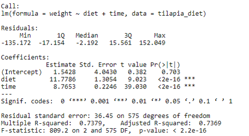

```{r setup, include=FALSE}
knitr::opts_chunk$set(echo = FALSE)
library(car)
library(lmtest)
library(psych)
library(readxl)
library(nlme)
library(lme4)
```

## PLAN DE LA CLASE
**1.- Introducción**
    
-Repaso de modelos lineales generales.

-Modelos lineales mixtos (MLM) ¿Por qué y para qué?

-Efectos fijos y efectos aleatorios.

-Ecuación del modelo lineal mixto (MLM).

-Interpretación de MLM con R.


**2.- Práctica con R y Rstudio cloud**

-Ajustar modelos lineales mixtos.

-Realizar gráficas avanzadas con ggplot2.

-Elaborar un reporte dinámico en formato pdf.


## **MODELOS LINEALES GENERALES**

Los modelos lineales generales son los modelos de regresión lineal simple, modelos de regresión lineal múltiple.

$$Y= X\beta + \epsilon$$
Efectos fijos ($X\beta$)

Efectos aleatorios ($\epsilon$)

Los modelos lineales generales deben cumplir los supuestos:

-Que no haya multicolinealidad (Regresión lineal múltiple).

-Que los residuos se distribuyan normal.

-Que haya homogeneidad de varianzas.


## **MODELOS LINEALES MIXTOS**

Los modelos lineales mixtos (MLM) son una generalización del modelo lineal de regresión clásico, contemplando la posible existencia de observaciones correlacionadas (ej. Medidas repetidas en el mismo individuo) o con variabilidad heterogénea, vinculadas a la presencia de factores aleatorios.

$$Y= X\beta + Zu + \epsilon$$
Efectos fijos ($X\beta$)

Efectos aleatorios ($Zu + \epsilon$)

Los modelos lineales mixtos surgen cuando no se cumplen los siguientes supuestos:

-Que hayan observaciones correlacionadas.

-Que NO haya homogeneidad de varianzas.

## **¿QUÉ SON EFECTOS FIJOS?**

- Los efectos fijos se asumen que son determinados a propósito por el analista de los datos, eso dependerá de las variables a las que se les desea estimar efectos promedios.

- Los efectos fijos solo estiman medias de las variables predictoras. 

- En un modelo lineal mixto las variables cuantitativas continuas o covariables pueden ser usadas como efectos fijos.
                
                 
## **¿QUÉ SON EFECTOS ALEATORIOS?**

- Los efectos aleatorios están asociados a grupos de observaciones.
Los efectos aleatorios estiman varianzas.

- Para considerar una variable predictora cualitativa como un efecto aleatorio del modelo lineal mixto, dicha variable debe tener al menos 5 niveles.

- Una variable predictora categórica con dos niveles (binaria) NO puede ser un efecto aleatorio.  

- Una variable aleatoria continua NO puede ser un efecto aleatorio. 

## **ALGUNOS EJEMPLOS DE EFECTOS ALEATORIOS**

i) Medidas repetidas sobre un mismo individuo (hay repeticiones).

ii) Respuestas observadas en grupos de unidades experimentales homogéneas (bloques), pueden ser piscinas o estanques.

iii) Mediciones de los animales (individuos) de una misma familia.

## **¿CÓMO SE PODRÍA DECIDIR SI ES EFECTO FIJO O ALEATORIO?**

**1).** ¿Cuál es el número de niveles?

- Pequeño (Fijo)

- Grande o infinito (Posiblemente aleatorio)


**2).** ¿Son los niveles repetibles?

- Sí (Fijo)

- No (Aleatorio)


**3).** ¿Se necesitan realizar inferencias para niveles no incluidos en el muestreo?

- No (Posiblemente fijo)

- Sí (Posiblemente aleatorio)

## **LIBRERÍA PARA AJUSTAR MODELOS LINEALES MIXTOS**


```{r, echo=TRUE}
library(lme4)
```

Función **lmer()**

Dimensión de la base de datos: 578 observaciones y 5 columnas. Se evaluaron 4 dietas. 

```{r,echo=FALSE}
tilapia_diet <- read_excel("tilapia_diet.xlsx")
pander::pander(head(tilapia_diet), caption = "Tabla de datos")
```

## **MODELO DE EFECTOS FIJOS**


```{r,echo=TRUE,out.width = '20%',fig.align='center'}
mod.1 <- lm(weight ~ diet + time, data = tilapia_diet)
```
```{r, echo=FALSE, out.width = '80%' }

```


## **MODELO DE EFECTOS FIJOS**

```{r,echo=TRUE,out.width = '20%',fig.align='center'}
mod.2 <- lm(weight ~ diet:time, data = tilapia_diet)
```

```{r, echo=FALSE, out.width = '80%' }

```


## **MODELOS LINEALES MIXTOS**

```{r,echo=TRUE,out.width = '30%',fig.align='center'}
mod.1r <- lmer(weight~ diet + time + (1|animal),
               data = tilapia_diet)
```

```{r, echo=FALSE, out.width = '60%' }

```

## **MODELOS LINEALES MIXTOS**

```{r,echo=TRUE,out.width = '30%',fig.align='center'}
mod.2r <- lmer(weight~diet + time + (time|animal),
               data = tilapia_diet)
```

```{r, echo=FALSE, out.width = '80%' }

```

## **SELECCIÓN DE MODELOS DE EFECTOS FIJOS**

Criterios de selección de modelos AIC y BIC usando anova()

anova(mod.1, mod.2)

```{r, echo=FALSE, out.width = '100%',fig.align='center'}

```

## **SELECCIÓN DE MODELOS MIXTOS**

Criterios de selección de modelos AIC y BIC usando anova()

anova(mod.1r, mod.2r)

```{r, echo=FALSE, out.width = '100%',fig.align='center'}

```

## RESUMEN DE LA CLASE

**1).** Revisión de conceptos: modelos lineales generales, modelos lineales mixtos.


**2).** Construir y ajustar modelos lineales mixtos.

    