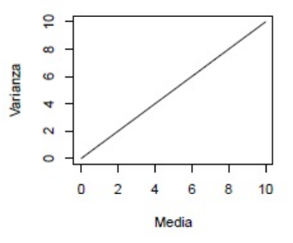

```{r setup, include=FALSE}
knitr::opts_chunk$set(echo = FALSE)
library(car)
library(lmtest)
library(psych)
library(readxl)
library(nlme)
library(lme4)
library(stats)
library(boot)
```

## PLAN DE LA CLASE
**1.- Introducción**
    
-Modelos lineales generalizados ¿Por qué y para qué?

-Componentes de un modelo lineal generalizado (MLG)

-Ecuación del MLG.

-Interpretación de MLG con R.

**2.- Práctica con R y Rstudio cloud**

-Ajustar modelos lineales generalizados.

-Realizar gráficas avanzadas con ggplot2.

-Elaborar un reporte dinámico en formato pdf.

## **¿POR QUÉ USAR MODELOS LINEALES GENERALIZADOS?**

- Modelos que reflejan mejor la naturaleza de los datos.

- Hay variables respuestas que son **_resistentes_** a ser transformadas (**por ej.** Variables discretas, o variables con gran cantidad de ceros).

- Las relaciones lineales generalmente fuerzan las predicciones del espacio de la variable respuesta (**por ej.** Predicción de valores negativos cuando la variable respuesta es un conteo). 

## **INTRODUCCIÓN**

Durante años, los modelos lineales clásicos (normales) han sido usados como la metodología de análisis a la hora de intentar describir la mayoría de los fenómenos que ocurren en el entorno. 
**¿Qué podemos hacer cuando los datos no se ajustan a un modelo lineal?**

Muchas veces se recurre a transformar la variable respuesta.
La transformación se realiza para producir aproximadamente:

*-*Normalidad 

*-*Homogeneidad 

*-*Linealidad

## **INTRODUCCIÓN**

- Pero al aplicar la transformación a la variable respuesta, NO necesariamente se cumplirían todos los supuestos. 

- Las interpretaciones deben hacerse en términos de la variable transformada.

Alternativa: **Modelos Lineales Generalizados (MLG)**
                   (Nelder y Wedderburn, 1972)

## **MODELOS LINEALES GENERALIZADOS**

Los modelos lineales generalizados extienden a los modelos lineales clásicos admitiendo distribuciones no normales para la variable respuesta y modelando funciones de la media.

Los MLG incluyen como casos particulares a los siguientes modelos:

- Modelos Lineales Clásicos: **Modelo de regresión lineal simple, modelo de regresión lineal múltiple, ANOVA , ANCOVA.**

- Modelo de regresión logística.

- Modelos log-lineales: **para tablas de contingencia**.

## **COMPONENTES DE UN MODELO LINEAL GENERALIZADO**

**1.** **Componente aleatorio**:

La variable respuesta y su distribución de probabilidad: **_la familia exponencial natural_**.

Por ej.                                            

$$Y_i \sim  N(\mu_i , \sigma^2)$$

$$E(Y_i) = \mu_i$$

$$var(Y_i)=\sigma^2$$

## **TIPOS DE DISTRIBUCIONES**

**La familia exponencial natural contiene las siguientes distribuciones:**

- Normal, Poisson, Binomial (Binaria: 0 y 1, caso particular de la binomial), Gamma, Binomial Negativa, Multinomial, entre otras.

- La elección del tipo de distribución a usar debe realizarse **_a priori_** por el analista de los datos, dependerá de la naturaleza de la variable respuesta (como se generaron los datos).

- Cada distribución se caracteriza por su relación **media** (parámetro de posición) y **varianza** (parámetro de dispersión).

## **FORMA EN QUE SE GENERAN LOS DATOS**

Hay que examinar cuidadosamente los datos, principalmente en cuantos a asimetría, naturaleza continua o discreta e intervalo de variación.

```{r, echo=FALSE, out.width = '100%',fig.align='center'}
knitr::include_graphics("Tabla.png")
```


## **RELACIÓN ENTRE EL PARÁMETRO DE POSICIÓN Y EL DE DISPERSIÓN**

```{r, echo=FALSE, out.width = '100%',fig.align='center'}

```

## **COMPONENTES DE UN MODELO LINEAL GENERALIZADO**

**2.** **Componente sistemático**: **_(es lineal e identifica la(s) variables predictoras)_**

- Las variables predictoras en el modelo pueden ser continuas, categóricas, funciones polinomiales, interacciones.

- Relaciona un vector $\eta$, (llamado **_predictor lineal_**) con las variables predictoras $X$ a través de un modelo lineal, esto es:

$$\eta (X_{i1},...,X_{ip})  = \beta_{0} + \beta_{1} X_{i1} + ... + \beta_{p} X_{ip}$$

## **COMPONENTES DE UN MODELO LINEAL GENERALIZADO**

**3.** **Función de enlace:**

Conecta los componentes **_aleatorio_** y **_sistemático_**.
Relaciona el valor esperado de la variable aleatoria con el **_predictor lineal_** mediante

$$g(\mu_i)= \eta (X_{i1},...,X_{ip})$$ 

Cada distribución posee su función de enlace, hay distribuciones que tienen más de una (por ej. Binomial (enlace **logit**, **probit** o **complemento log-log**).

## **EL MODELO LINEAL VISTO COMO UN MODELO LINEAL GENERALIZADO**

**El modelo lineal clásico es un caso particular de modelo lineal generalizado**

- **Componente aleatorio:** Las $Y_i$ son variables aleatorias independientes 

$$Y_i \sim  N(\mu_i , \sigma^2)$$
 
- **Componente sistemático:** El predictor lineal es

$$\eta (X_{i1},...,X_{ip})  = \beta_{0} + \beta_{1} X_{i1} + ... + \beta_{p} X_{ip}$$

- **Función de enlace:** **Identidad**

$$g(\mu_i)= \mu_i$$ 

## **DISTRIBUCIONES Y SUS FUNCIONES DE ENLACE**

```{r, echo=FALSE, out.width = '100%',fig.align='center'}

```

## **¿QUÉ MODELOS COMPARAR?**

- **Modelo nulo:** No ofrece ninguna explicación para los datos, se expresa como $y \sim 1$ es el modelo más simple, tiene solo un parámetro, representa la media global $\mu_i$ para todos los $y$. Toda la variación de $y$ se le atribuye al **componente aleatorio**. 

- **Modelo saturado:** Es el modelo más extremo, tiene $n$ parámetros.

- **Modelo corriente:** es el que intentamos buscar, aquel que explique la mayor parte de la variación de los datos, pero que use el menor número de parámetros posibles.

## **¿CÓMO CONOZCO EL AJUSTE DEL MODELO?**

Una medida de bondad de ajuste del modelo es la **Deviance** (también llamada **devianza**).

$$Dev=-2log(\displaystyle{L(Modelo_{corriente}) \over L(Modelo_{saturado})}$$
$$Dev\sim \chi^2$$

- **Modelo nulo**: tiene la **máxima devianza**.

- **Modelo saturado**: Tiene **devianza igual a cero**.

- **Modelo corriente**: es el que deja una devianza residual **lo más pequeña posible**.


## **RELACIÓN MEDIA-VARIANZA PARA IDENTIFICAR LA POSIBLE DISTRIBUCIÓN DE MI VARIABLE RESPUESTA**

El supuesto central que se hace en los modelos lineales es 
que la varianza es constante, así que al variar la media
 la varianza se mantiene constante.

```{r, echo=FALSE, out.width = '60%',fig.align='center'}

```

## **RELACIÓN MEDIA-VARIANZA PARA IDENTIFICAR LA POSIBLE DISTRIBUCIÓN DE MI VARIABLE RESPUESTA**

En el caso de variables respuestas de conteo expresadas como números enteros y en donde puede haber muchos ceros en los datos, la varianza se suele incrementar linealmente con la media.

```{r, echo=FALSE, out.width = '60%',fig.align='center'}

```

## **RELACIÓN MEDIA-VARIANZA PARA IDENTIFICAR LA POSIBLE DISTRIBUCIÓN DE MI VARIABLE RESPUESTA**

Cuando la variable respuesta sea proporciones de eventos es muy posible que la varianza se comporte en forma de U invertida.  

```{r, echo=FALSE, out.width = '60%',fig.align='center'}

```


## **RELACIÓN MEDIA-VARIANZA PARA IDENTIFICAR LA POSIBLE DISTRIBUCIÓN DE MI VARIABLE RESPUESTA**

Cuando la variable respuesta se aproxime a una distribución gamma, entonces la varianza se incrementa de una manera no lineal con respecto a la media. 

```{r, echo=FALSE, out.width = '60%',fig.align='center'}

```

## **CONCEPTOS CLAVE**

- Elegimos a priori una distribución para la variable respuesta, basada en su naturaleza y su relación media-varianza.

- Elijo una función de enlace que proyecta la predicción en el espacio de la variable respuesta.

- Construyo un modelo con variables $X$ predictoras.

- Obtengo la **Devianza** del modelo que me interesa y la comparo con la del modelo saturado.

- El modelo debe tener sentido desde el punto de vista particular de la aplicación.

## **LIBRERÍA PARA AJUSTAR MODELOS LINEALES GENERALIZADOS**

```{r, echo=TRUE}
library(stats)
```

Función **glm()**

## **EJEMPLO: SALMÓN DEL ATLÁNTICO**

Con el objeto de estudiar el efecto del tratamiento veterinario sobre la mortalidad del salmón del Atlántico, se consideraron seis grupos de 40 salmones, sometiendo cada grupo a una dosis diferente del tratamiento veterinario, y se reportaba el número de muertos en cada grupo. 

```{r,echo=FALSE}
salmones <- read_excel("salmones.xlsx")
pander::pander(head(salmones), caption = "Tabla de datos")
```

## **PROPORCIÓN DE SALMONES MUERTOS**

```{r,echo=TRUE,out.width = '85%',fig.align='center'}
muertos <- salmones$muertos
total <- salmones$`total individuos`
dosis <- salmones$dosis
prop<-muertos/total
plot(dosis,prop)
```


## **PROPORCIÓN DE SALMONES MUERTOS**

```{r,echo=TRUE,out.width = '100%',fig.align='center'}
ldosis<-log(dosis,2)
plot(ldosis,prop)
```

## **EJEMPLO: SALMÓN DEL ATLÁNTICO**

Se debe generar la variable $y$ para realizar el ajuste del modelo binomial con la función **glm()**, y debe tener la siguiente estructura:

```{r,echo=TRUE,out.width = '80%',fig.align='center'}
muertos <- salmones$muertos
total <- salmones$`total individuos`
y<- cbind(muertos,total-muertos)
```

## **EJEMPLO: SALMÓN DEL ATLÁNTICO**

- Modelo ajustado con un enlace **logit**:

```{r,echo=TRUE,out.width = '20%',fig.align='center'}
ajustelogit<-glm(y~ldosis,family=binomial(link="logit"))
plogit<-1-pchisq(6.313,4)
```

```{r, echo=FALSE, out.width = '70%',fig.align='right'}

```


## **EJEMPLO: SALMÓN DEL ATLÁNTICO**

- Modelo ajustado con un enlace **probit**:

```{r,echo=TRUE,out.width = '20%',fig.align='center'}
ajusteprobit<-glm(y~ldosis,family=binomial(link="probit"))
pprobit<-1-pchisq(4.871,4)
```

```{r, echo=FALSE, out.width = '70%',fig.align='right'}

```


## **EJEMPLO: SALMÓN DEL ATLÁNTICO**

- Modelo ajustado con un enlace **complemento log-log**:

```{r,echo=TRUE,out.width = '20%',fig.align='center'}
ajusteclog<-glm(y~ldosis,family=binomial(link="cloglog"))
pclog<-1-pchisq(5.1964,4)
```

```{r, echo=FALSE, out.width = '70%',fig.align='right'}

```


## **EJEMPLO: SALMÓN DEL ATLÁNTICO**

```{r,echo=TRUE,out.width = '75%',fig.align='center',message=FALSE}
library(boot)
plot(ldosis,prop)
lines(ldosis, fitted.values(ajustelogit), type="l")
lines(ldosis, fitted.values(ajusteprobit), type="l",
      col="red")
lines(ldosis, fitted.values(ajusteclog), type="l", 
      col="blue")
```

## **EJEMPLO: SALMÓN DEL ATLÁNTICO**

**TABLA RESUMEN**

```{r, echo=FALSE, out.width = '100%',fig.align='center'}

```

- Con ninguna de las tres funciones de enlace se rechaza la adecuación del modelo al 5%.

- Notemos que usando el enlace **probit** el criterio de AIC dio menor y además se observa en el gráfico que la curva ajustada usando dicha función de enlace ajusta mejor los valores observados, por lo tanto será el ajuste seleccionado.

## RESUMEN DE LA CLASE

**1).** Revisión de conceptos: modelos lineales generales, modelos lineales generalizados.

**2).** Construir y ajustar modelos lineales generalizados.

    